.. _Screen Designs:

Screen Descriptions
====================

AcornAccounting is web-based and each distinct web page is considered a screen.
Each screen is generated by the `Django`_ back-end framework and will use the
`Twitter Bootstrap`_ front-end framework.

The following :term:`wireframes <wireframe>` may not be rendered/styled with the
front-end elements and are meant to convey the layout of the application, not
it's final appearance or style.

The Wireframes are built using `Pencil`_ and the Pencil Document is
:download:`available for download <_files/wireframe.ep>`.

Global Design
--------------

The following design features will be implemented consistently throughout the
application:

* All Date fields will require the input to be in some combination of
  ``MM/DD/YYYY`` or ``M/D/YY`` format, such as ``01/2/13`` or ``3/20/12``.
  Clicking a Date field will pop-up a calendar, allowing the User to select a
  date, instead of having to enter one.

* Table rows will change their font/background colors to a unique set when
  moused over.

* Negative balances and amounts will be surrounded by parenthesis,
  ``($22.00)``, instead of having minus signs, ``-$22.00``.

.. _General Layout Design:

General Layout
---------------

The general layout of the website will follow the basic Header-Content-Footer
model:

* Header - Company Logo/Title, Navigation
* Content - Each screens unique content
* Footer - Copyright, Additional Links(feedback, bug report, documentation)

.. figure:: _images/wireframes/general_layout.png
    :alt: The Header/Content/Footer layout of the application.
    :scale: 50 %
    :align: center

    The general layout of the application.

There will be no global sidebars.

.. _Site Navigation Design:

Navigation
-----------

The Navigation will be placed in the ``Header`` section of the :ref:`General
Layout <General Layout Design>`.

The navigation will contain multiple dropdown-menus and autocomplete inputs:

* A Logo and/or Company Name(hyperlinked to the :ref:`Home Page <Home Page
  Design>`)
* An :ref:`Accounts Sub-menu <Accounts Submenu Design>`
* An :ref:`Entry Sub-menu <Entry Submenu Design>`
* A :ref:`Reports Sub-menu <Reports Submenu Design>`
* An :ref:`Accounts Autocomplete Input <Autocomplete Inputs>`
* A :ref:`Bank Journals Autocomplete Input <Autocomplete Inputs>`
* A :ref:`Admin Sub-menu <Admin Submenu Design>`

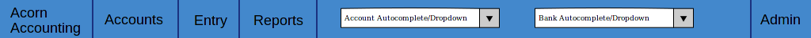

    The Base Navigation Menu.

.. _Accounts Submenu Design:

Accounts Sub-Menu
++++++++++++++++++

The ``Accounts`` Sub-Menu will contain the following Items and Links:

* :ref:`Chart of Accounts <Chart of Accounts Page Design>`
* :ref:`General Ledger <General Ledger Page Design>`
* :ref:`Budgeted Accounts`
* Member Stipends - Linking to the ``Member's Stipends`` :ref:`Chart of
  Accounts Page <Chart of Accounts Page Design>`
* Member Deposited Assets - Linking to the ``Member's Deposited Assets``
  :ref:`Chart of Accounts Page <Chart of Accounts Page Design>`
* :ref:`Account History Page`

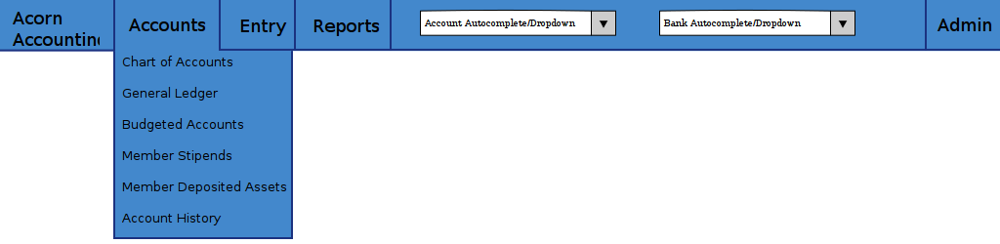

    The Accounts Sub-Menu.

.. _Entry Submenu Design:

Entry Sub-Menu
+++++++++++++++

The ``Entry`` Sub-Menu will contain the following Items and Links:

* :ref:`General Entry <Add Journal Entry Page Design>`
* :ref:`Transfer <Add Transfer Entry Page Design>`
* :ref:`Bank Spending <Add Bank Spending Entry Page Design>`
* :ref:`Bank Receiving <Add Bank Receiving Entry Page Design>`

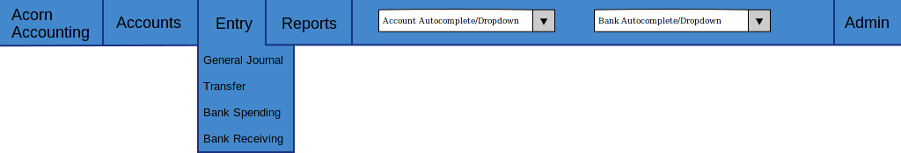

    The Entry Sub-Menu.

.. _Reports Submenu Design:

Reports Sub-Menu
+++++++++++++++++

The ``Reports`` Sub-Menu will contain the following Items and Links:

* :ref:`Events <Event Report Page Design>`
* :ref:`Profit & Loss <PL Reports>`

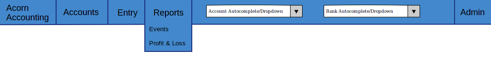

    The Reports Sub-Menu.

.. _Admin Submenu Design:

Admin Sub-Menu
+++++++++++++++

The ``Admin`` Sub-Menu will contain the following Items and Links:

* :ref:`Add Header <Header Admin Design>`
* :ref:`Add Account <Account Admin Design>`
* :ref:`Add Event <Event Admin Design>`
* :ref:`New Fiscal Year <Add Fiscal Year Page Design>`

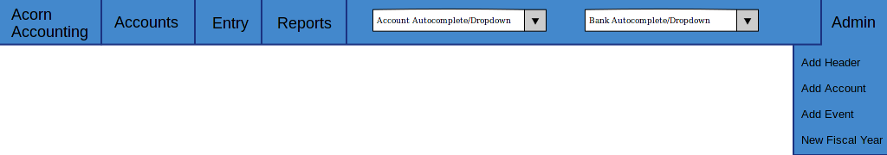

    The Admin Sub-Menu.

.. _Autocomplete Inputs:

Autocomplete Inputs
++++++++++++++++++++

An ``Autocomplete`` Input Widget allows users to enter filtering text and
select items from a dropdown box. The Inputs will be pre-populated will all
respective items. When the user enters text, a dropdown will appear with
suggested completions that the user can select. The user can also click the
Input Widget, causing it to display a selectable list of all items.

Upon item selection, the application will redirect the user to a specific page:

* The item's :ref:`Account Detail Page <Account Detail Page Design>` for the
  ``Accounts`` Autocomplete Input
* The item's :ref:`Bank Journal Page <Bank Journal Page Design>` for the
  ``Bank Journal`` Autocomplete Input

For a working example of this functionality, see the `Select2 Widget`_.

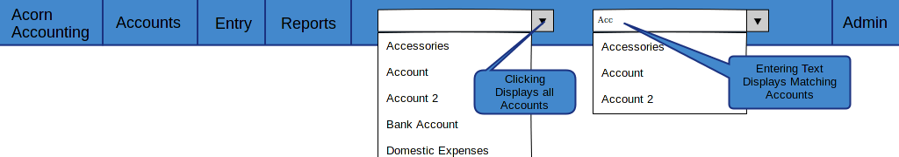

    An example of the Autocomplete Input Widgets.

.. _Home Page Design:

Home Page
----------

The Home Page will be the :ref:`Chart of Accounts Page <Chart of Accounts Page
Design>`.

In the future, the content may change to show recent activity and priority
items(see :ref:`Alternate Home Page`).

**Entry Conditions**

The Home Page will be accessible through the application's base URL(e.g.
www.acornaccounting.com/). The :ref:`Navigation's <Site Navigation Design>`
Company Title and Logo will be a hyperlink, directing the User to the Home
Page.

.. _Admin Pages Design:

Admin Pages
------------

The Application will initially use the default `Django`_ admin app for
generating administration pages. The admin app will be used for Creating and
Editing Headers, Accounts and Events. Eventually custom administration pages
will be made for Creating each item, while Edit links will be placed in the
:ref:`Account Detail Page <Account Detail Page Design>` and :ref:`Event Detail
Page <Event Detail Page Design>`.

**Entry Conditions**

The admin back-end will be accessible by clicking on the :ref:`Admin
Sub-Menu <Admin Submenu Design>`, specific pages will be accessible by clicking
on the respective items in the Sub-Menu.

**Initial Conditions**

If the User is logged in, a table will be displayed, showing links to the
Accounts, Headers and Events sub-pages.

Otherwise, a login form containing fields for a Username and Password will be
displayed.

**Final Conditions**

If the User is not logged in, submitting the form will validate the User's
Login Credentials, redirecting to the main Admin Page if valid.

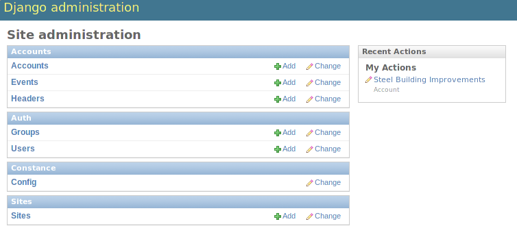

    The Main Administration Page, created by Django's Admin App.

.. _Header Admin Design:

Headers Admin
++++++++++++++

.. _Account Admin Design:

Accounts Admin
+++++++++++++++

.. _Event Admin Design:

Events Admin
+++++++++++++

.. _Chart of Accounts Page Design:

Chart of Accounts Page
-----------------------

The Chart of Accounts Page displays all Headers and Accounts of the Company,
and their respective Balances.

*Case 1* describes accessing the global Chart of Accounts. *Case 2* describes
accessing the Chart of Accounts recursively, by clicking on a Header row in
the Chart of Accounts.

**Entry Conditions**

*Case 1*

This screen is accessible through the ``Chart of Accounts`` link in the
:ref:`Accounts Sub-Menu <Accounts Submenu Design>`.

It is currently the :ref:`Home Page <Home Page Design>` and therefore clicking
the Company Name/Logo to the left of the :ref:`Navigation <Site Navigation
Design>` will redirect the user to this screen.

*Case 2*

The screen is also recursively accessible, clicking on a Header row in this
screen will send the User to a Chart of Accounts Page for that specific Header.

**Initial Conditions**

*Case 1*

The page will display a series of tabs above a single table. The Tabs will be
named by the different Account Types(Assets, Liability, Equity, etc.) and the
currently selected tab will be differentiated by color. By default the table
will contain all Headers and Accounts that are Assets and the Asset Tab will be
selected.

The Table will have headings for Account Numbers, Names, Descriptions and
Current Balances. The Headers' font and background colors will be different
from Accounts'. Child Headers and Accounts will have their names indented one
level higher than their Parent Header, like in the following example::

    I am the Highest Header
        I am its child Account
        I am a sub-Header
            I am the sub-Header's child Account

Mousing over a row should highlight that row in a unique color, and removing
the mouse from a row should revert the effect.

*Case 2*

If the screen is accessed recursively by a Header row hyperlink, the screen
will emulate *Case 1* except the tabs will be replaced with breadcrumb links up
the Header's ancestor tree. Instead of showing all Headers and Accounts, only
the children of the selected Header will be displayed.

**Intermediate Conditions**

*Case 1*

Clicking an Account Type Tab will replace the table, Headers, and Accounts
currently displayed with a table containing all Headers and Accounts of the
newly selected Account Type.

**Final Conditions**

Each row of the table will be a hyperlink. Header rows will link back to the
Chart of Accounts Page, using the selected Header for *Case 2*. Account rows
will link to the Account's :ref:`Account Detail Page <Account Detail Page
Design>`.

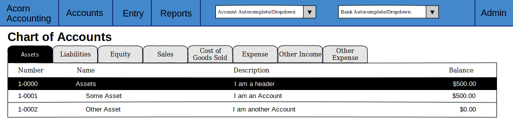

    A Sample Chart of Accounts Page(*Case 1*).

.. _Account Detail Page Design:

Account Detail Page
---------------------

The Account Detail Page will be used to display Transactions associated with
a specific Account within a User-specified date range.

**Entry Conditions**

This screen is accessible by clicking on an Account row on the :ref:`Chart of
Accounts <Chart of Accounts Page Design>` or the :ref:`General Ledger <General
Ledger Page Design>`, and by selecting an Account from the :ref:`Account
Autocomplete Input <Autocomplete Inputs>`.

**Initial Conditions**

The page will contain a Date Range form, a Heading, several hyperlinks for
administration and a table for displaying the Account's Transactions.

The Date Range form will have 2 Text Input Widgets, labeled ``Start Date:`` and
``End Date:``. They will be used to control the date range of Transactions
shown. The ``Start Date`` will default to the first day of the current month
while the ``End Date`` will default to the current date.

The Heading will display the Account's Number, Name and Current Balance.

There will be 2 hyperlinks for Accountants/Administrators, ``Edit`` for
changing the Account's details(name, parent, balance, etc.) and ``Reconcile``
for reconciling the Account against Bank Statements.

The table will be populated with Transactions within the date range. The table
will have headings for the Entry Number, Date, Memo, Transaction Detail,
Debit/Credit, Event and Account Balance. The Account Balance will only be shown
if the date range is within the current Fiscal Year.

The table will contain a footer that displays the total amounts of Debits and
Credits and the Net Change(Credits - Debits) for the date range. If the date
range is within the current Fiscal Year, a ``Start Balance`` and ``End
Balance`` will also be shown.

**Final Conditions**

The ``Edit`` Hyperlink will direct the User to the Account's :ref:`Edit
Page <Account Admin Design>`. The ``Reconcile`` Hyperlink will direct the User
to the Account's :ref:`Reconcile Page <Reconcile Account Page Design>`.

Clicking on a row in the table will direct the user to the :ref:`Entry Detail
Page <Journal Entry Detail Pages Design>` for the specific Transaction. If an
item in the ``Event`` column is clicked, the User will be directed to the
:ref:`Event Detail Page <Event Detail Page Design>` for the Event.

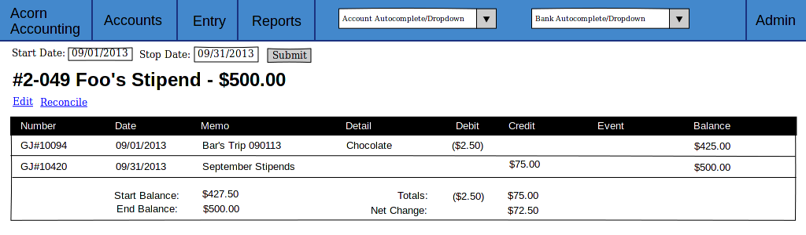

    A Sample Account Detail Page.

.. _Event Detail Page Design:

Event Detail Page
------------------

The Event Detail Page will be used to display all Transactions associated with
a specific event.

**Entry Conditions**

The Event Detail page may be reached from the :ref:`Events Report Page <Event
Report Page Design>` by clicking a row in the table or from the :ref:`General
Ledger Page <General Ledger Page Design>`, :ref:`Bank Journal Page <Bank
Journal Page Design>` or the :ref:`Account Detail Page <Account Detail Page
Design>` by clicking on an Event in the Page's table's ``Event`` column.

**Initial Conditions**

The page will contain a Title Heading, Sub-Heading and Table.

The Title Heading will be composed of the Event Name and Number, the
Sub-Heading will contain the City, State and Date of the Event.

The table will be populated with Transactions that are associated with the
Event. It should have headings for the Transaction's Entry Number, Date,
Account, Memo, the Transaction's Detail, and Credit/Debit Amount.

The table will contain a footer that displays the total amounts of Debits and
Credits and the Net Change for the Event.

**Final Conditions**

Clicking a row in the table should direct the User to the :ref:`Entry Detail
Page <Journal Entry Detail Pages Design>` for the selected Transaction/Entry.
However, if a row is clicked in the ``Account`` column the User will be
directed to the :ref:`Account Detail Page <Account Detail Page Design>` for the
selected Transaction.

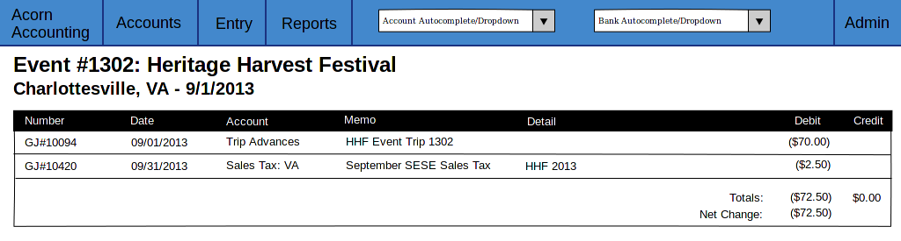

    A Sample Event Detail Page.

.. _Account History Page:

Account History Page
---------------------

The Account History page will show Account Balances and Net Changes for each
month in previous Fiscal Years.

.. note:: Historical Accounts are only generated after creating a second Fiscal
    Year. If Fiscal Years are not used or only one Fiscal Year has been
    created, there will be no Account History pages.

**Entry Conditions**

This screen is accessible via the ``Account History`` link in the
:ref:`Accounts Sub-Menu <Accounts Submenu Design>`. The default month displayed
is the current month in the previous year. Other months may be accessed by
``Next`` and ``Previous`` hyperlinks on this screen.

**Initial Conditions**

The screen contains a Title Heading, hyperlinks for month navigation and tabs
above a table.

The Title Heading will contain ``Account History`` and the month/year being
displayed, in ``MM/YYYY`` format.

There will be ``Previous`` and ``Next`` hyperlinks, allowing the User to view
the Account History for a different month.

There will be 2 tabs, one labeled ``Balances`` and one labeled ``Profit &
Loss``. The currently selected tab should be differentiated by color. By
default, the ``Balances`` tab will be selected. The ``Balances`` tab will
contain Accounts that are Assets, Liabilities and Equities. The ``amount``
column for these Accounts will represent the month-end balances. The ``Profit &
Loss`` tab will contain all other Account Types(Expenses and Incomes), their
``amount`` column represents the Net Change in value for the month.

The table will display the Historical Accounts for the selected month and year.
The table will have headings for Account Numbers, Names and Amounts.

**Intermediate Conditions**

Clicking on a tab will toggle which Historical Accounts are shown in the table.

**Final Conditions**

Clicking on the ``Next`` or ``Previous`` hyperlinks will direct the User to
the next or previous month's Account History.

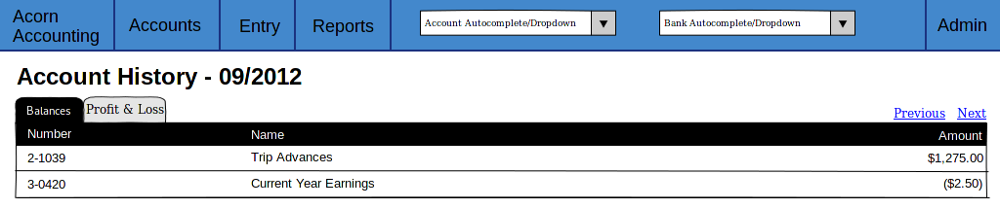

    A Sample Account History Page.

.. _Journal Entry Detail Pages Design:

Journal Entry Detail Pages
--------------------------

The Journal Entry Detail pages will be responsible for display information
about a specific Journal Entry and it's associated Transactions.

There are three types of Journal Entries:

* :ref:`Bank Receiving Entry <Bank Receiving Entry Detail Design>` - Entries
  that put money into a Bank Account (checks, ACH payments, cash deposits,
  etc.)
* :ref:`Bank Spending Entry <Bank Spending Entry Detail Design>` - Entries that
  take money out of a Bank Account (checks, cash withdrawals, etc.)
* :ref:`General Journal Entry <General Journal Entry Detail Page Design>` -
  Entries not related to Bank Accounts (internal transfers, cash drawer
  withdrawals, etc.)

.. _General Journal Entry Detail Page Design:

General Journal Entry
++++++++++++++++++++++

**Entry Conditions**

The General Entry page will be accessible by clicking an Entry on the
:ref:`General Ledger Page <General Ledger Page Design>`, or by clicking a
Transaction on the :ref:`Account Detail Page <Account Detail Page Design>` or
:ref:`Event Detail Page <Event Detail Page Design>`.

After submitting valid data on the :ref:`Add Journal Entry Page <Add Journal
Entry Page Design>`, the User will be redirected to this page if they do not
choose to add more Entries.

**Initial Conditions**

The page will contain Headings, administrative information/hyperlinks, and a
table for displaying the Journal Entry's Transactions.

The Heading will display the Entry's date, memo and number.

A ``Created`` and ``Updated`` (if applicable) Date should be shown, along with
a link for Accountants to Edit the Entry.

The Table will be populated with the Entry's Transactions. It will have
headings for the Transaction's Account, Detail, Debit/Credit Amount and Event.
The table will have a footer showing the total amount of Credits and Debits.

**Final Conditions**

The ``Edit`` Hyperlink will direct the User to the :ref:`Add Journal Entry Page
<Add Journal Entry Page Design>` for the Entry(*Case 2*).

Clicking a row in the Transaction table will direct the User to the
:ref:`Account Detail Page <Account Detail Page Design>` for the Transaction's
Account.

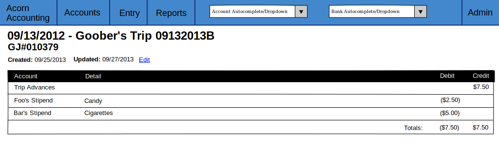

    Sample Journal Entry Detail Page.

.. _Bank Receiving Entry Detail Design:

Bank Receiving Entry
+++++++++++++++++++++

**Entry Conditions**

The Bank Receiving Entry page will be accessible by clicking an Entry on the
:ref:`Bank Journal Page <Bank Journal Page Design>` or by clicking a
Transaction on the :ref:`Account Detail Page <Account Detail Page Design>` or
:ref:`Event Detail Page <Event Detail Page Design>`.

The User is redirected to this Page after submitting valid data on the
:ref:`Add Bank Receiving Entry Page <Add Bank Receiving Entry Page Design>`.

**Initial Conditions**

The page will contain Headings, administrative information/hyperlinks, and a
table for displaying the Bank Receiving Entry's Transactions.

The Headings will display the Entry's date, bank account, memo, entry number,
payor and debit amount.

A ``Created`` and ``Updated`` (if applicable) Date should be shown, along with
a link for Accountants to Edit the Entry.

The Table will be populated with the Bank Receiving Entry's Transactions. It
will have headings for the Transaction's Account, Detail, Credit Amount and
Event.

**Final Conditions**

The ``Edit`` Hyperlink will direct the User to the :ref:`Add Bank Receiving
Entry Page <Add Bank Receiving Entry Page Design>` for the Entry(*Case 2*).

Clicking a row in the Transaction table will direct the User to the
:ref:`Account Detail Page <Account Detail Page Design>` for the Transaction's
Account.

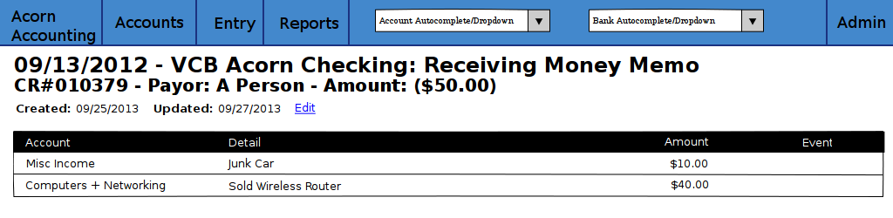

    Sample Bank Receiving Entry Detail Page.

.. _Bank Spending Entry Detail Design:

Bank Spending Entry
++++++++++++++++++++

**Entry Conditions**

The Bank Spending Entry page will be accessible by clicking an Entry on the
:ref:`Bank Journal Page <Bank Journal Page Design>` or by clicking a
Transaction on the :ref:`Account Detail Page <Account Detail Page Design>` or
:ref:`Event Detail Page <Event Detail Page Design>`.

**Initial Conditions**

The page will contain Headings, administrative information/hyperlinks, and a
table for displaying the Bank Spending Entry's Transactions.

The Headings will display the Entry's Date, Bank Account, Memo, Number,
Payee and Credit Amount.

.. note::
     The Entry Number will be ``CD# <check_number>`` for entries with Check
     Numbers and ``CD###ACH###`` for entries that are ACH Payments.

A ``Created`` and ``Updated`` (if applicable) Date should be shown, along with
a link for Accountants to Edit the Entry.

The Table will be populated with the Bank Receiving Entry's Transactions. It
will have headings for the Transaction's Account, Detail, Debit Amount and
Event.

**Final Conditions**

The ``Edit`` Hyperlink will direct the User to the :ref:`Add Bank Spending
Entry Page <Add Bank Spending Entry Page Design>` for the Entry(*Case 2*).

Clicking a row in the Transaction table will direct the User to the
:ref:`Account Detail Page <Account Detail Page Design>` for the Transaction's
Account.

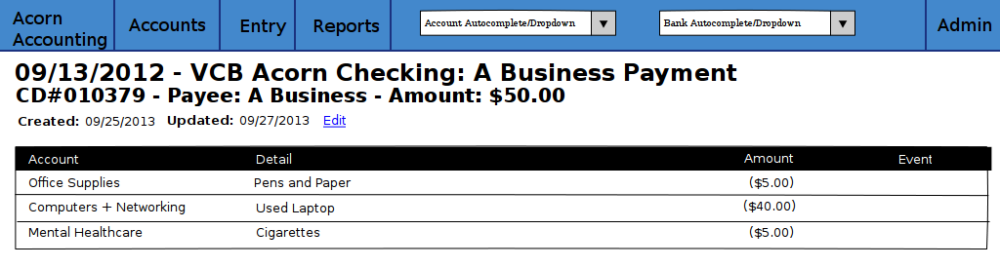

    Sample Bank Spending Entry Detail Page for an Entry with a ``Check
    Number``.

.. _General Ledger Page Design:

General Ledger Page
--------------------

The General Ledger page will be used to display all General Journal Entries and
their associated Transactions within a user-specified date range.

**Entry Conditions**

This screen is only accessible through the ``General Ledger`` item in the
:ref:`Navigation's <Site Navigation Design>` :ref:`Accounts Sub-Menu <Accounts
Submenu Design>`.

**Initial Conditions**

The page will contain a Date Range form, a Heading, and a table for displaying
General Journal Entries within the Date Range.

The Date Range form will have 2 Text Input Widgets, labeled ``Start Date:`` and
``End Date:``. They will be used to control the date range of Journal Entries
shown. The ``Start Date`` will default to the first day of the current month
while the ``End Date`` will default to the current date.

The Heading will display ``General Ledger`` and the current date range.

The table will be populated with General Journal Entries within the date range.
The table will display each Journal Entry's Number, Date and Memo, along with
the Accounts, Details, Credits/Debits and Events of the Journal Entry's
Transactions.

**Final Conditions**

Submitting a valid ``Start`` and ``End`` date will cause the page to reload,
filling the table with General Journal Entries from the submitted date range.

Clicking on a Journal Entry row in the table will direct the user to the
:ref:`Detail Page <General Journal Entry Detail Page Design>` for the selected
Journal Entry. Clicking on an Account row in the table will direct the user to
the :ref:`Account Detail Page <Account Detail Page Design>` for the selected
Account. Clicking on an Event in the table will direct the user to that Event's
:ref:`Detail Page <Event Detail Page Design>`.

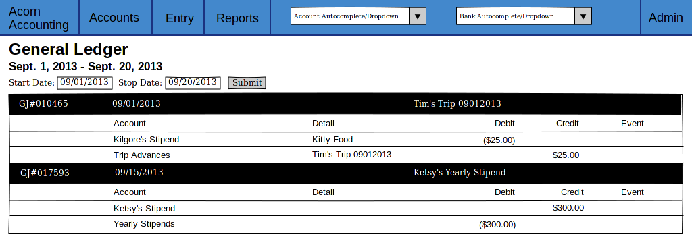

    A Sample General Ledger Page, showing two General Journal Entries.

.. _Bank Journal Page Design:

Bank Journal Page
-------------------

The Bank Journal page will be used to display a Bank Account's Bank Spending
and Bank Receiving Entries within a user-specified date range.

.. note::
    Accounts are designated as Bank Accounts in the :ref:`Account Admin Page
    <Account Admin Design>`.

**Entry Conditions**

The Bank Journal page will be accessed through the :ref:`Bank Journal
Autocomplete Input <Autocomplete Inputs>` in the :ref:`Navigation Menu <Site
Navigation Design>`. Submitting a valid Bank Account will direct the user to
the Bank Journal page for that Account.

**Initial Conditions**

The page will contain a Date Range form, a Heading, and a table for displaying
Bank Spending and Receiving Entries within the Date Range.

The Date Range form will have 2 Text Input Widgets, labeled ``Start Date:`` and
``End Date:``. They will be used to control the date range of Bank Entries
shown. The ``Start Date`` will default to the first day of the current month
while the ``End Date`` will default to the current date.

The Heading will display the Account's Name, ``Journal`` and the current date
range.

The table will be populated with Bank Spending and Receiving Entries within the
date range. The table will display each Bank Entry's Number, Date and Memo,
along with the Accounts, Details, Credits/Debits and Events of the Bank Entry's
Transactions.

**Final Conditions**

Submitting a valid ``Start`` and ``End`` date will cause the page to reload,
filling the table with Bank Entries associated with the Bank Account within the
submitted date range.

Clicking on a Bank Spending Entry row will direct the user to its
:ref:`Spending Detail Page <Bank Spending Entry Detail Design>`, a Bank
Receiving Entry to its :ref:`Receiving Detail Page <Bank Receiving Entry Detail
Design>`. Clicking on an Account row in the table will direct the user to the
:ref:`Account Detail Page <Account Detail Page Design>` for the selected
Account. Clicking on an Event in the table will direct the user to that Event's
:ref:`Detail Page <Event Detail Page Design>`.

.. figure:: _images/wireframes/bank_journal.png
    :alt: A Sample Bank Journal Page.
    :width: 700px
    :align: center

    A Sample Bank Journal Page, showing both Bank Spending and Bank Receiving
    Entries.

.. _Event Report Page Design:

Event Report Page
------------------

Not yet designed or implemented. See :ref:`Event Reports`.

.. _Reconcile Account Page Design:

Reconcile Account Page
-----------------------

The Reconcile Account page will be used to reconcile an Account's Balance and
Transactions against a statement.

*Case 1* describes the initial Reconcile screen. *Case 2* describes this screen
after a Statement Balance and Date are entered.

.. uml::
    :includegraphics: scale=.55

    title Account Reconciliation Process

    (*) --> "Click Reconcile Link"
    --> "<i>Case 1</i> Initial Page"
    --> "Enter Statement Date and Balance"
    -l-> "Submit Form"
    if "Valid Form" then
        -->[true] "<i>Case 2</i> Initial Page"
        -d-> "Check Transactions to Reconcile"
        if "Submit Form" then
            -->[Get Transactions] "Submit Form"

        else
            -->[Reconcile] if "Valid Form" then
                -->[true] "Mark as Reconciled"
                -d-> "Redirect to Account Detail"
                --> (*)
            else
                ->[false] "Show Errors"
                --> "Check Transactions to Reconcile"
            endif
        endif
    else
        -->[false] "Show Statement Date\nor Balance Errors"
        --> "Enter Statement Date and Balance"
    endif

**Entry Conditions**

*Case 1*

The Reconcile Account screen is accessible through the ``Reconcile`` link on
the :ref:`Account Detail Page <Account Detail Page Design>`.

*Case 2*

Submitting a valid ``Statement Balance`` and ``Statement Date`` on the Account
Reconcile *Case 1* screen will direct the User to the *Case 2* screen.

**Initial Conditions**

*Case 1*

The screen will contain a Heading and a form to retrieve Transactions.

The heading will be ``Reconcile`` followed by the Account's Name.

The form will have inputs for the Statement Date and Statement Balance. If the
Account has previously been reconciled, the previous Statement Date and
Statement Balance will also be shown(labeled as the ``Last Reconciled Date``
and ``Reconciled Balance``).

The Statement Date will default to the current date. The Statement Balance will
default to the Reconciled Balance.

The form will be submit by a button labeled ``Get Transactions``.

*Case 2*

This screen will contain all elements of *Case 1* with an additional table,
displaying all unreconciled Transactions associated with the Account that are
dated before the submitted ``Statement Date``.

The table will contain checkboxes to toggle whether a Transaction is to be
reconciled and each Transaction's information. The table headers will be a
checkbox(to toggle all Transactions on or off) and the Transaction's Date,
Entry Number, Entry Memo, Debit/Credit Amount, Event.

The Table will have footer that displays the Debit/Credit totals, net change
and out of balance amount for all selected Transactions. The out of balance
amount is determined by adding the last reconciled balance to the statement
balance and subtracting by the net change. It represents the Transaction
Credit/Debit total required to make the Reconciled Balance equal to the
Statement Balance.

The ``Get Transactions`` button will resubmit only the Statement Date and
Balance, retrieving Transactions from before the new Statement Date.

A ``Reconcile Transactions`` button will also be present, underneath the
Transaction table. This button will be used for final form submission.

**Intermediate Conditions**

*Case 1*

The ``Statement Balance`` will be required to be a valid number.

*Case 2*

Toggling the checkbox in the table header will cause all listed Transactions to
be selected or unselected. Selecting a Transaction's checkbox will update the
Debit/Credit totals, the Net Change and Out of Balance Amounts.

The form will only be considered valid if the out of balance amount is equal
to ``$0.00``, i.e. if ``reconciled balance + net change = statement balance``.

**Final Conditions**

*Case 1*

Submitting a valid form by using the ``Get Transactions`` page will return the
Screen for *Case 2*.

*Case 2*

The ``Get Transactions`` button will refresh the Screen retrieving different
Transactions if the ``Statement Date`` was changed.

Submitting a valid form using the ``Reconcile Transactions`` button will change
the Account's reconciled balance to the ``Statement Balance`` and mark each
selected Transaction as reconciled. The User will be redirected to the
:ref:`Account's Detail Page <Account Detail Page Design>`.

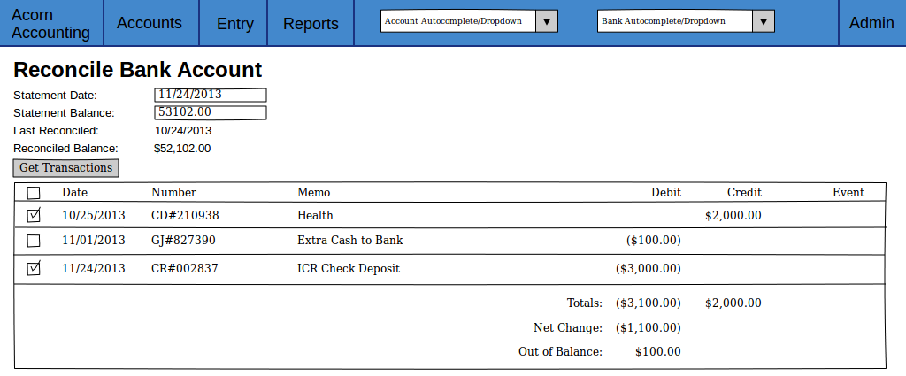

    A Sample Account Reconciling Page, showing Transactions marked for
    reconciliation(*Case 2*).

Journal Entry Creation Pages
-----------------------------

The Journal Entry Creation Pages will be responsible for creating/editing and
validating new Entries and Transactions.

.. uml::
    :includegraphics: scale=.55

    title General Entry Creation Workflow

    (*) -->[<i>Case 1</i>] "Click Add Link"
    --> "Fill Form"
    (*) -->[<i>Case 2</i>] "Click Edit Link"
    --> "Fill Form"
    --> "Submit Form"
    if "Valid Form" then
        -->[true] if "Delete?" then
            -l->[yes] "Delete Entry"
            if "Bank Entry?" then
                -->[yes] "Redirect to Bank Journal"
                --> (*)
            else
                -->[no] "Redirect to General Ledger"
                --> (*)
            endif
        else
            -->[no] "Create/Update Entry"
            --> if "Add Another?" then
                ->[yes] "Redirect to <i>Case 1</i>"
                --> "Fill Form"
            else
                -l->[no] "Redirect to\nEntry Detail Page"
                -l-> (*)
            endif
        endif
    else
        -l->[false] "Show Errors"
        -u-> "Fill Form"
    endif

.. _Add Journal Entry Page Design:

Add Journal Entry
++++++++++++++++++

The Add Journal Entry Page will be used to create new General Journal
Entries(*Case 1*) and edit existing Entries(*Case 2*).

**Entry Conditions**

*Case 1*

This Page is accessible through the ``General Journal`` link in the :ref:`Entry
Sub-Menu <Entry Submenu Design>`.

*Case 2*

Clicking the ``Edit`` link in a General Journal Entry's :ref:`Detail
Page <Journal Entry Detail Pages Design>` will direct the User to this Page.

**Initial Conditions**

The page will contain a Heading and a form to enter Entry details.

The form should contain 2 sections, one for the overall entry details and a
table containing each Transaction's details.

The Entry details part of the form will include inputs for the Entry Date, Memo
and Additional Comments.

The Transaction table will have headers for each Transaction's Account,
Details, Debit/Credit Amount, Event and for deleting the row. There will be a
link to add additional rows to the table. The table's footer will show the
Debit and Credit totals and the amount the entry is Out of Balance(the Credit
total minus the Debit total).

The form will contain two buttons, ``Submit`` and ``Submit & Add More``.

*Case 2*

All inputs will contain the details of the Journal Entry being edited.

A ``Delete`` button will be on the Page in addition to the 2 ``Submit``
buttons.

**Intermediate Conditions**

The Date and Memo fields, and at least two Transactions, are required.

Only a Debit or Credit may be entered in each row, a Transaction cannot have
both.

Changing a Debit or Credit amount will update the Credit/Debit Totals and Out
of Balance amounts.

Checking a row's Delete box will remove that row from the table and update the
Totals and Out of Balance amounts.

A valid form will have a Debit Total equal to it's Credit Total, resulting in
an Out of Balance amount of zero.

**Final Conditions**

A valid form will create the Journal Entry and the entered Transactions,
redirecting the User to the Entry's :ref:`Detail Page <Journal Entry Detail
Pages Design>`.

If the form was submit using the ``Submit & Add More`` button, the Screen will
refresh with a blank form.

*Case 2*

Submitting the form using the ``Delete`` button will delete the Entry and its
Transactions, redirecting the User to the :ref:`General Ledger <General Ledger
Page Design>`.

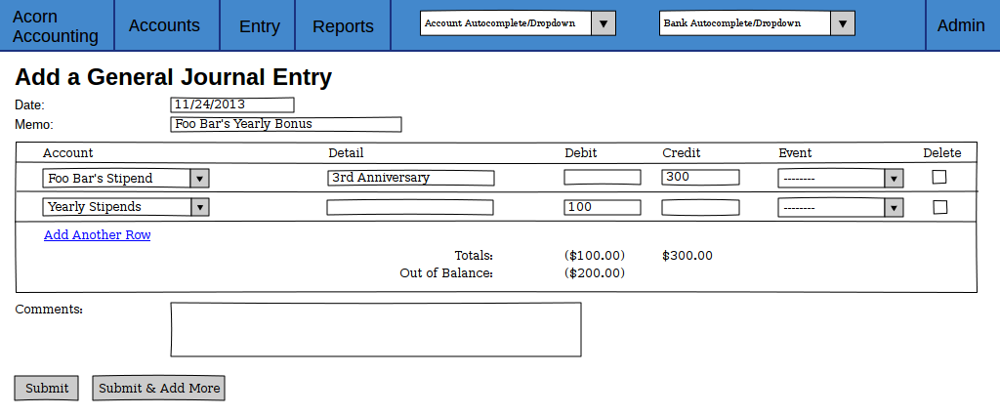

    A Sample Add Journal Entry Page, showing an Out of Balance entry.

.. _Add Transfer Entry Page Design:

Add Transfer Entry
++++++++++++++++++++++++

This Page will be used create Entry's that transfer discrete amounts between
two Accounts.

**Entry Conditions**

This Page is accessible through the ``Transfer`` link in the :ref:`Entry
Sub-Menu <Entry Submenu Design>`.

**Initial Conditions**

This Page mimics the :ref:`Add Journal Entry Page <Add Journal Entry Page
Design>`, except the table contains Source, Destination and Amount columns
instead of the Account, Credit and Debit Columns. The table will not contain
Total or Out of Balance amounts.

**Intermediate Conditions**

A source, destination and amount for at least one Transaction is required.

Checking a row's Delete box will remove that row from the table.

**Final Conditions**

A valid form will create a General Entry and two Transactions for each row in
the table, one will debit the Source Account and the other will credit the
Destination Account. The User will be redirected to the Entry's :ref:`Detail
Page <Journal Entry Detail Pages Design>`.

If the form was submit using the ``Submit & Add More`` button, the Screen will
refresh with a blank form.

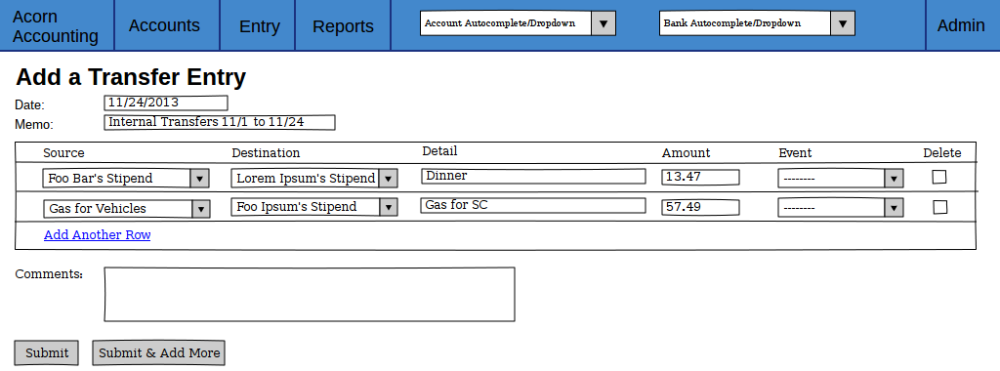

    A Sample Add Transfer Entry Page, showing 2 rows which will create 4
    Transactions.

.. _Add Bank Receiving Entry Page Design:

Add Bank Receiving Entry
++++++++++++++++++++++++++++++

This Page is used to enter and update deposits to Bank Accounts.

**Entry Conditions**

*Case 1*

This Page is accessible through the ``Bank Receiving`` link in the :ref:`Entry
Sub-Menu <Entry Submenu Design>`.

*Case 2*

Clicking the ``Edit`` link in a Bank Receiving Entry's :ref:`Detail
Page <Journal Entry Detail Pages Design>` will direct the User to this Page.

**Initial Conditions**

This Page mimics the :ref:`Add Journal Entry Page <Add Journal Entry Page
Design>`, except for some differences in fields.

The entry fields will also include an Account, Payor and Amount. The Accounts
field will be limited to Accounts that are Bank Accounts. The Transaction table
will contain a single Amount field instead of Credit and Debit fields.

*Case 2*

All inputs will contain the details of the Receiving Entry being edited.

A ``Delete`` button will be on the Page in addition to the 2 ``Submit``
buttons.

**Intermediate Conditions**

A Bank Account, Date, Amount, Memo and at least one Transaction is required.

Checking a row's Delete box will remove that row from the table.

**Final Conditions**

A valid form will create or update the Bank Receiving Entry and the entered
Transactions. The User will be redirected to the :ref:`Bank Receiving Entry's
Detail Page <Bank Receiving Entry Detail Design>`.

If the form was submit using the ``Submit & Add More`` button, the Screen will
refresh with a blank form.

*Case 2*

Submitting the form via the ``Delete`` button will remove the Bank Receiving
Entry and it's Transactions, refunding each Account's balance. The User will
be redirected to the :ref:`Bank Account's Journal <Bank Journal Page Design>`.

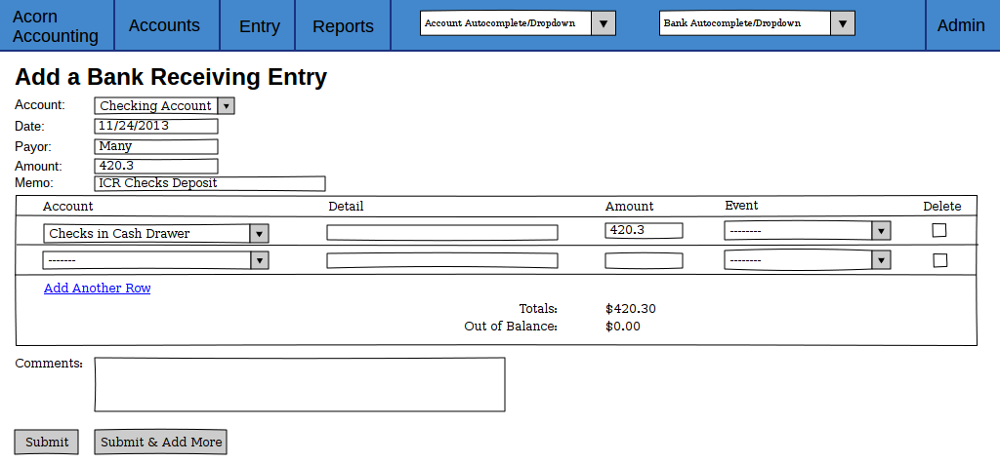

    A Sample Add Bank Receiving Entry Page, showing a balanced deposit.

.. _Add Bank Spending Entry Page Design:

Add Bank Spending Entry
+++++++++++++++++++++++++++++

This Page is used to enter and update withdrawals from Bank Accounts.

**Entry Conditions**

*Case 1*

This Page is accessible through the ``Bank Receiving`` link in the :ref:`Entry
Sub-Menu <Entry Submenu Design>`.

*Case 2*

Clicking the ``Edit`` link in a Bank Receiving Entry's :ref:`Detail
Page <Journal Entry Detail Pages Design>` will direct the User to this Page.

**Initial Conditions**

This Page mimics the :ref:`Add Journal Entry Page <Add Journal Entry Page
Design>`, except for some differences in fields.

The entry fields will also include an Account, Payee, ACH Payment, Check Number
and Amount. The Accounts field will be limited to Accounts that are Bank
Accounts. The Transaction table will contain a single Amount field instead of
Credit and Debit fields.

*Case 2*

All inputs will contain the details of the Receiving Entry being edited.

A ``Delete`` button will be on the Page in addition to the 2 ``Submit``
buttons.

**Intermediate Conditions**

A Bank Account, Date, Amount, Memo and at least one Transaction is required.
The entry must either be specified as an ACH Payment or have a Check Number.
Check Numbers must be unique per Bank Account.

Checking a row's Delete box will remove that row from the table.

**Final Conditions**

A valid form will create or update the Bank Spending Entry and the entered
Transactions. The User will be redirected to the :ref:`Bank Spending Entry's
Detail Page <Bank Spending Entry Detail Design>`.

If the Entry is specified as Void, it's Transactions are refunded and it's
Amount zeroed.

If the form was submit using the ``Submit & Add More`` button, the Screen will
refresh with a blank form.

*Case 2*

Submitting the form via the ``Delete`` button will remove the Bank Spending
Entry and it's Transactions, refunding each Account's balance. The User will
be redirected to the :ref:`Bank Account's Journal <Bank Journal Page Design>`.

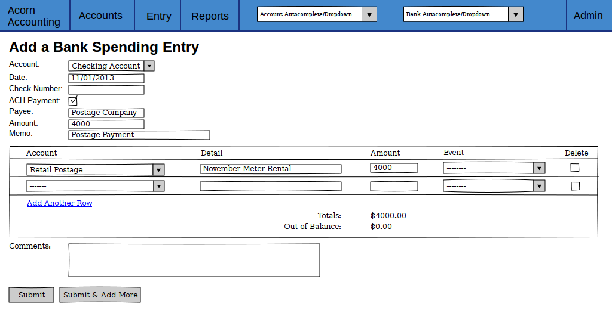

    A Sample Add Bank Receiving Entry Page, showing a balanced ACH withdrawl.

.. _Add Fiscal Year Page Design:

Add Fiscal Year Page
--------------------

This Page will be used to start new Fiscal Years, purging Transactions from
previous years and resetting Income and Expense balances.

.. uml::
    :includegraphics: scale=.4

    title Fiscal Year Creation Process

    (*) --> "Click New Fiscal Year Link"
    -> "Enter new Year,\nEnding Month and Period"
    --> "Select Accounts to Exclude"
    --> "Submit Form"
    --> "Confirm Submission"
    if "Valid Form" then
        -->[true] if "First Fiscal Year" then
            -->[yes] "Create Fiscal Year"
            --> (*)
        else
            ->[no] "Create Historical Accounts"
            --> "Delete Entries\nfrom Previous Year"
            --> "Reset Account Balances"
            --> "Move Current Year Earnings\nto Retained Earnings"
            --> "Create Fiscal Year"
        endif
    else
        ->[false] "Show Errors"
        --> "Enter new Year,\nEnding Month and Period"
    endif

**Entry Conditions**

This Page is accessible through the ``New Fiscal Year`` link in the :ref:`Admin
Sub-Menu <Admin Submenu Design>`.

**Initial Conditions**

The Page will contain a Heading, explanation text and a form to enter the new
Year's details and select Accounts to exclude from purging.

The explanation text should describe the procedure of creating a New Fiscal
Year and warnings of the irreversible deletions caused by starting a New Year.

The Fiscal Year Form will have fields for the Year, Ending Month and Period of
the new Year. There will be a table containing all Accounts, with columns for
checkboxes, the Account Names and Last Reconciled dates. Any Account that has
been reconciled previously will default to being excluded.

**Intermediate Conditions**

If there is a pre-existing Fiscal Year, the new Year must be after the Ending
Month and Year of the previous Year. The difference between the previous and
new Year's Ending Month and Year cannot be greater than the new Year's period.

The ``Current Year Earnings`` and ``Retained Earnings`` Equity Accounts are
required to have been created.

**Final Conditions**

If there is a pre-existing Fiscal Year:

* Historical Accounts will be created for the previous Year
* All Journal Entries that do not have unreconciled Transactions with Accounts
  selected in the Exclude table will be deleted
* The balance for all Income, Cost of Sales, Expense, Other Income and Other
  Expense Accounts will be set to zero at the beginning of the new year
* The balance of the Current Year Earnings Account will be transfered to the
  Retained Earnings Account

The User will be redirected to the :ref:`Chart of Accounts <Chart of Accounts
Page Design>`.

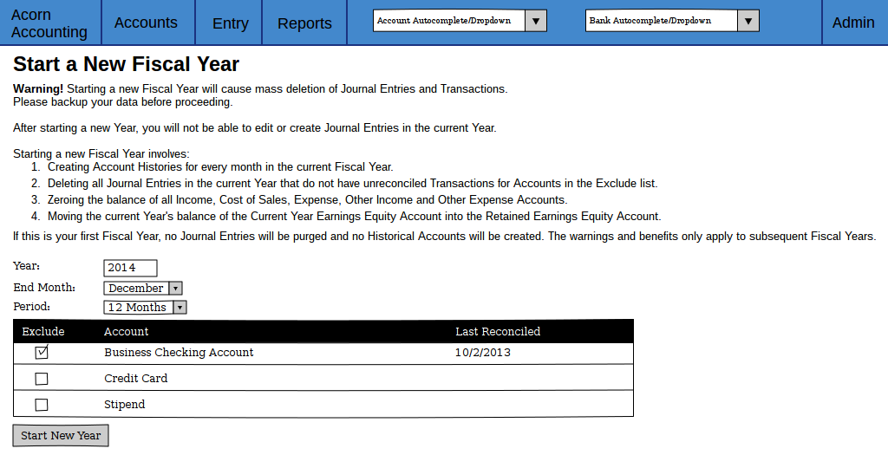

    A Sample New Fiscal Year Page, showing the default of checking previously
    reconciled Accounts.

.. _Django: https://www.djangoproject.com/
.. _Twitter Bootstrap: http://getbootstrap.com/
.. _Pencil: http://pencil.evolus.vn/
.. _Select2 Widget: http://ivaynberg.github.io/select2/
