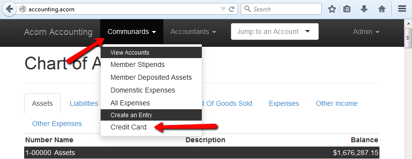
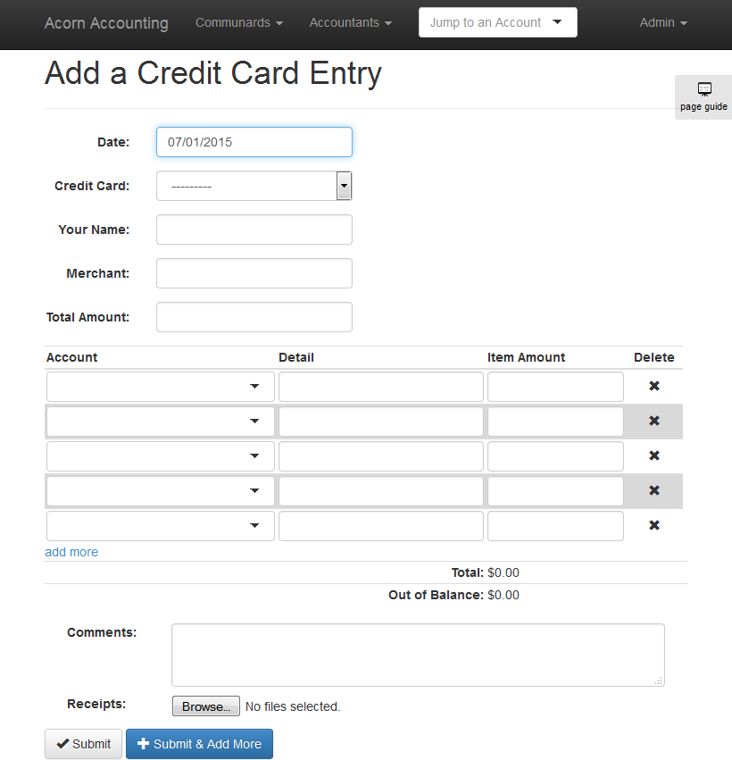
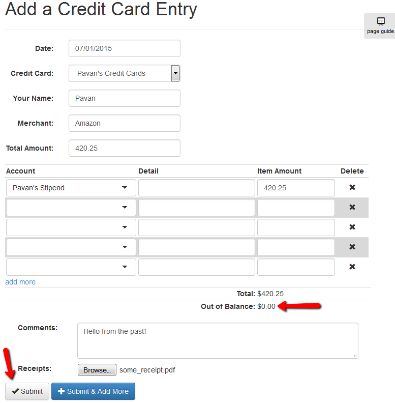
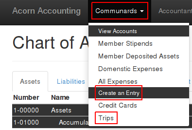
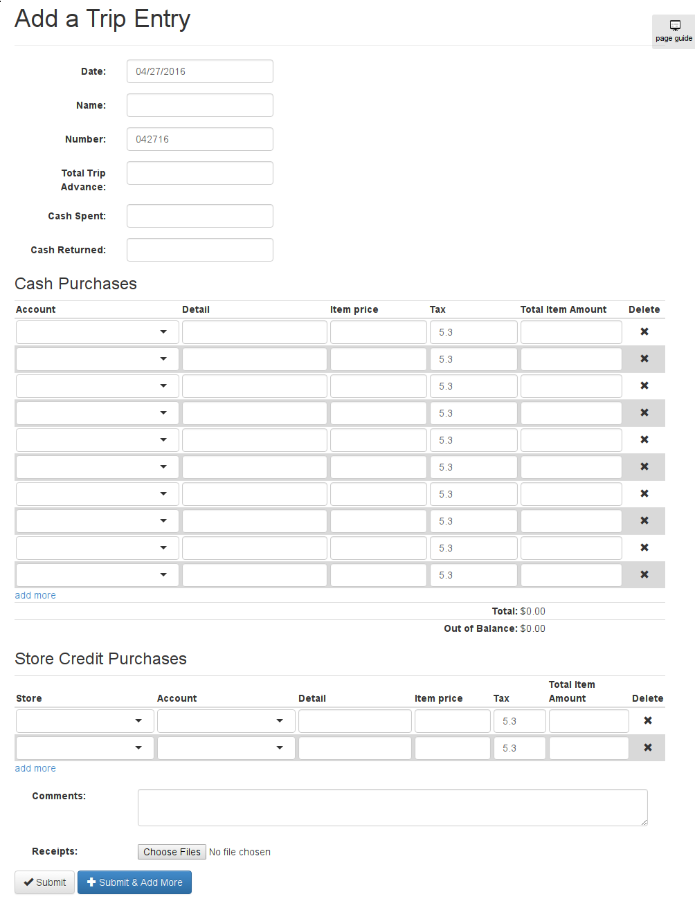
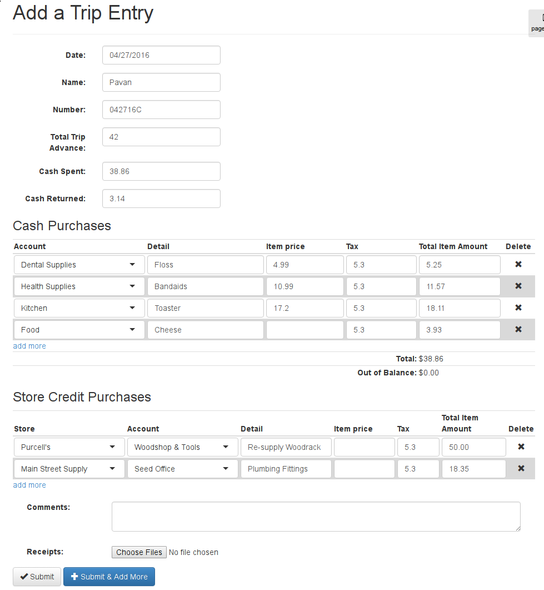
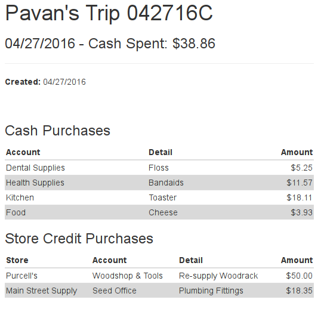

.. _User Guide:

==================
User Guide
==================

This guide goes over how Communards can do things like check their Stipend
balance, or enter Trip forms & how Accountants can do things like import Bank
Statements or add Credit Cards to the Accounting Application.

Everyone should read the :ref:`First Time User Guide`, and Accountants are
encourage to read the entire guide.

Communards
-----------

The following guides apply to **all** Communards, both Accountants &
Non-Accountants.

.. _First Time User Guide:

First Time User Guide
======================

* Using Firefox is highly recommended. Most of the browser testing is done in
  Firefox, so Chrome may cause some unique UI issues.
* If you're unfamiliar with the Accounts you can make charges too, the homepage
  of the Accounting Application shows the Chart of Accounts. You can click the
  different tabs to show different account types. You're most likely interested
  in the Accounts under the ``Expenses`` tab, although large infrastructure
  purchases may be found under the ``Assets`` tab.
* When entering dates, you don't have to enter leading zeros or the first two
  digits of the year. ``1/5/17`` is the same as ``01/05/2017``.
* When entering numbers into the ``Amount`` fields of forms, do not enter a
  dollar sign or comma separators.
* When selecting an Account in a form, you can type any part of the Account's
  name *and/or* description. For example, if you don't know what to charge
  batteries to, you can type ``bat`` into the field and ``Appliance
  Maintenance`` will show up(assuming your Accountants have added ``batteries``
  to the description of the ``Appliance Maintenance`` account). If you have
  trouble identifying the proper account for an item, tell your Accountant so
  they can add it to the description.
* To save time, you can combine multiple identical charges into a single
  charge. For example, instead of making 4 $1.50 charges for ``Toothbrushes``,
  you can make a single $6 charge for ``Toothbrushes x4``.
* When in doubt or something out of the ordinary is happening in your entry,
  leave a comment for your Accountant.
* When an appropriate Account doesn't exist, use ``Misc Income`` or ``Misc
  Expense`` and leave a comment.
* In form tables, you can press ``Tab`` to move to the next field in the row(or
  down a row if you are on the last field). ``Enter`` will move the cursor to
  the first field of the next row.
* On some pages, you will see a ``Page Guide`` button attached to the
  right-side of the page. You can click this for in-depth information about the
  current page:

    .. figure:: _images/page_guide.png
        :alt: The Page Guide Button
        :width: 825px
        :align: center

        Click the Page Guide button to get a detailed description of any form
        fields.

  You can click the numbers to select a specific hint or press the arrow buttons to go forwards & backwards:

  .. figure:: _images/page_guide_hints.png
        :alt: The Page Guide's Hints and Arrows
        :width: 815px
        :align: center

        Click the numbers to jump to a hint, click the arrows or arrow keys to scroll through the hints.

Checking Your Stipends & Deposited Asset Balances
==================================================

Every communard has both a ``Stipend`` and a ``Deposited Assets`` Account.
Stipends are where you monthly stipend is paid, and where the funds for most
expenses come from. Deposited Assets include any outside funds you have
deposited.

To check the balance of either Account, type your name into the ``Jump to an
Account`` input in the navigation menu. You should see your Accounts in the
dropdown menu, select one of the Accounts to be taken to it's Details page,
which shows a list of deposits and withdrawals.

You can also find a list of everyone's stipend or deposited assets, by clicking
opening the ``Communards`` and clicking ``Member Stipends`` or ``Member
Deposited Assets`` under the ``View Accounts`` heading.

Submitting Credit Card Entries
===============================

Credit Card Entries are a way for Communards to enter their Credit Card
purchases directly into the Accounting system. All entries will be approved by
an Accountant before taking effect.

When you make a purchase with a credit card, you should either request/print a
receipt or save your receipt as a PDF file.

Open up the Accounting Application and in the navigation menu, open the
``Communards`` menu and click the ``Credit Card`` link under the ``Create an
Entry`` header:

You will be brought to a blank Credit Card Entry form:

To fill out the form:

#. Fill out the ``Purchase Date``, your ``Name``, the ``Merchant`` you made the
   purchase at, the ``Total Amount`` you spent, and select the ``Credit Card``
   you used from the dropdown menu.
#. In the Account/Detail/Amount table, enter the ``Account`` to charge your
   purchase to, a ``Detail`` that descriptions the item or service, and the
   ``Amount`` for each item purchased from the merchant.
#. If you require additional rows to enter items into, click the ``add more``
   link at the bottom of the table.
#. Use the ``Total`` and ``Out of Balance`` counters at the bottom of the
   table to make sure the the ``Item Amounts`` sum up to the ``Total Amount``
   spent. The ``Out of Balance`` counter should be zero.
#. If there is something abnormal about your purchase, enter any relevent
   information for the approving Accoutant in the ``Comments`` field.
#. If you have digital receipts for the purchase, attach them using the
   ``Browse...`` button.
#. You can now submit your entry. If you attached a receipt you can use the
   ``Submit & Add More`` button to submit the entry and start filling out
   another one.
#. If you did not attach a receipt, you will be taken to a page showing your
   entry. You should print this page out, staple any receipts to it, & submit
   it to your Accountants.

Here is an example of a completed Credit Card Entry:

.. _Submitting Trip Entries:

Submitting Trip Entries
========================

Trip Entriees let Communards enter their :term:`Town Trips <Town Trip>` directly
into the Accounting system. All entries are approved by an Accounted before
taking effect.

You may also use this form to enter purchases made on store credit, but if
*all* your purchases were made on store credit, you should file an Internal
Transfer instead.

After you've taken your Town Trip and made some purchases, open up the
Accounting Application and in the navigation menu, click the ``Communards``
menu and choose ``Trips`` from the ``Create an Entry`` header:

This will bring you to a blank Trip Entry form:

To fill out the form:

#. Enter the ``Date`` of trip, your ``Name``, your trip ``Number`` (including a
   trailing letter if it has one).
#. In ``Total Trip Advance``, enter how much money you took out for the trip.
#. Either the total amount you spent into ``Cash Spent``, or the total amount
   you had left at the end of the trip into ``Cash Returned``. You only need to
   fill one of them in, the other field will be automatically calculated using
   the ``Total Trip Advance``.
#. Enter every item you purchased into a row in the ``Cash Purchases`` table.
   For each purchase, select an ``Account`` to charge the purchase to, and
   enter a description of the item or service into the ``Detail`` field. You
   can have the form calculate the total price with tax by entering the ``Item
   Price`` and ``Tax`` fields, or you can just enter the total yourself into
   the ``Total Item Amount`` field.
#. If you mess up a row, you can hit the ``Delete`` button to remove it. If you
   need to add more rows to the table, click the ``add more`` link at the
   bottom of the table.
#. Once you've filled the table with all of your cash purchases, you should
   make sure the ``Out of Balance`` counter at the bottom of the table is zero.
   If it is not, then the ``Total`` counter at the bottom of the table does not
   match your ``Cash Spent``.
#. Now enter any purchases you made on store credit in the ``Store Credit
   Purchases`` table. This is like the previous table, but you must also
   specify the store where you made the purchase.
#. If there's anything unusual about your trip, enter a detail description into
   the ``Comments`` field.
#. If you have any electronic receipts for the trip, include them using the
   ``Receipts`` field.
#. Once you'r satisfied, click ``Submit``. Only click ``Submit & Add More`` if
   you've attached every receipt to the form.
#. If your entry is valid, you will be redirected to a page showing the details
   of your entry. **Print this page and staple your receipts to it. Then turn
   it into Accounting so that your trip may be approved.**

Here is an example of a completed Trip Entry:

And the details page:

Accountants
------------

The following will be created/migrated from the acorn wiki:

* Credit Card Entries
    * Approving
* Trip Entries
    * Adding Local Stores
    * Approving
* Bank Statements
    * Adding Banks
    * Importing Statements
* Fiscal Years

Eventually something super in-depth, maybe like:

#. Configuration
#. Your First 5 Minutes
#. Headers
#. Accounts
#. Events
#. Entrys
#. Fiscal Years
#. Reports

Each section should talk about creating, editing and viewing details.
Maybe sections for various pages:

#. The Bank Register
#. The General Ledger
#. The Chart of Accounts

This is kinda low priority, but the basics and peculiarities should be covered
before v1.0.

